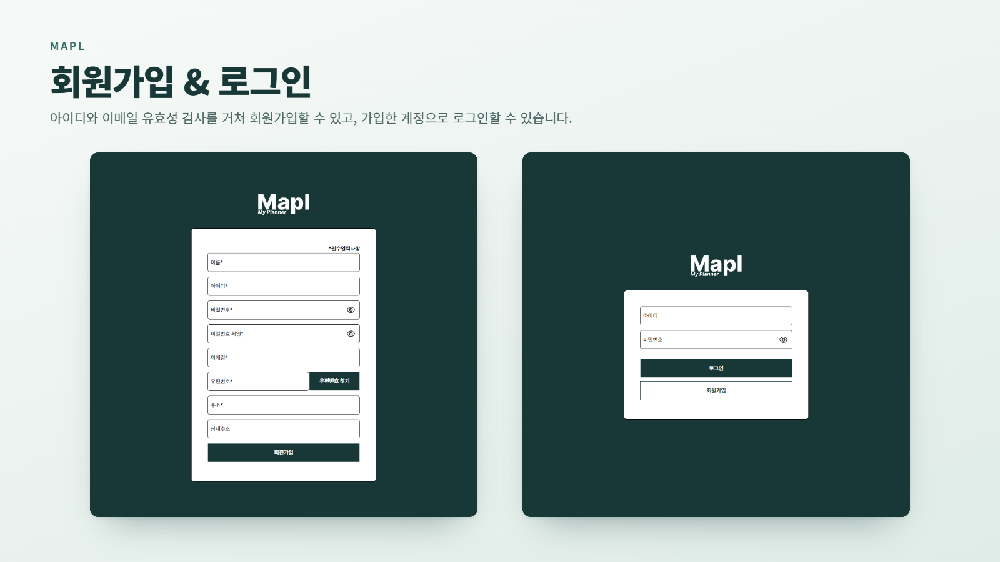
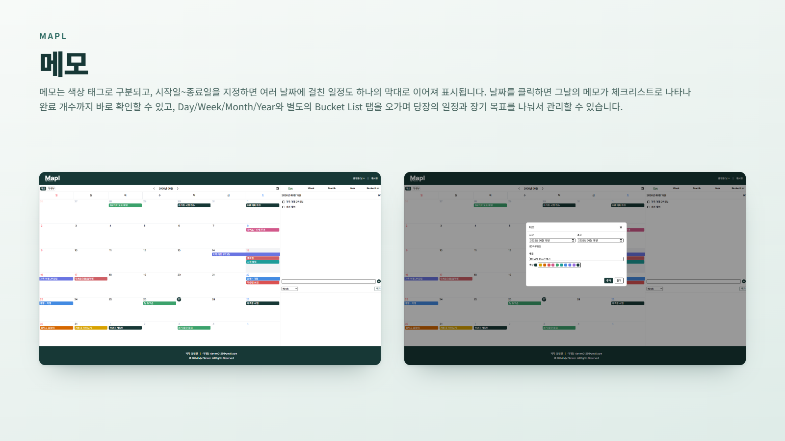
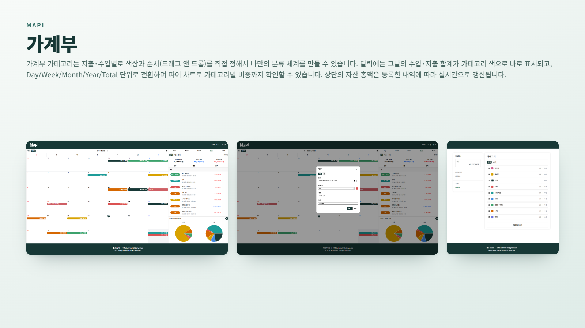
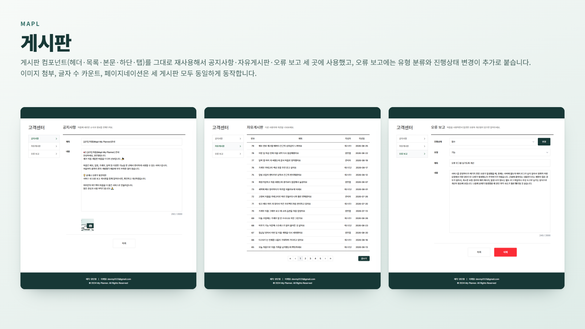

# Mapl (마플 My Planner)

## 기술 스택

#### Frontend

  

#### Backend

   

#### Data & UI

   

#### Integrations

 

#### Deployment

   

---

## 프로젝트 소개

달력을 중심으로 일정을 메모로 기록하고, 필요할 땐 그날의 수입·지출까지 함께 확인할 수 있는 개인용 플래너입니다.

### 주제 선정 이유

- 회사 업무와 개인 메모를 동시에 편하게 쓸 수 있는 메모장이 필요해서 만들기 시작
- 일정과 지출을 한 달력에서 직관적으로 함께 보고 싶었음

### 프로젝트 정보

| 항목      | 내용                                              |
| --------- | ------------------------------------------------- |
| 형태      | 개인 프로젝트 (기획 · 설계 · 개발 · 배포 1인 진행) |
| 개발 기간 | 2025.01 ~ 2025.08 |

---

## 실행 방법 & 테스트 계정

### 배포 사이트에서 바로 체험하기

**배포 링크**: [https://mapl.vercel.app/](https://mapl.vercel.app/)

> Render 무료 플랜 특성상 초기 접속 시 서버 활성화로 잠시 지연될 수 있습니다.

| 구분      | 아이디    | 비밀번호                                                |
| --------- | --------- | -------------------------------------------------------- |
| 테스트 계정 | `mapltest3` | <details><summary>보기</summary>mapltest3#</details> |

---

## 핵심 기능

### 회원가입 · 로그인



- **API 요청 중 401이 발생하면 자동으로 토큰을 재발급받아 재시도** - accessToken이 만료돼 401이 오면 httpOnly 쿠키에 저장된 refreshToken으로 새 토큰을 받아 원래 요청을 자동으로 재시도합니다.
- **세션 만료는 별도로 구분해서 처리** - 세션이 만료된 경우만 따로 구분해 자동 로그아웃 후 로그인 페이지로 보내고, 그 외 에러는 공통 모달로 안내합니다.
- **아이디·이메일 중복 확인을 동시에 요청** - 회원가입 제출 시 두 검사를 순차가 아니라 병렬로 보내 응답을 기다립니다.
- **필드별 정규식 실시간 검증 + 비밀번호 확인 양방향 동기화** - 비밀번호를 다시 입력하면 이미 입력해둔 비밀번호 확인 필드도 즉시 재검증됩니다.
- **Daum 우편번호 API로 실제 주소 입력 지원** - 검색 팝업에서 고른 주소가 우편번호·주소 필드에 자동으로 채워집니다.

### 메모



- **메모 동기화로 여러 메모를 한 번에 관리** - 메모를 서로 동기화해두면 수정·완료 체크·삭제가 한 번에 반영되고, 필요 없어지면 동기화를 해제할 수도 있습니다.
- **여러 주에 걸친 일정도 하나의 막대처럼 이어 보이게 렌더링** - 달력이 주 단위로 줄바뀌어도 시작일과 각 주의 첫 칸에서만 라벨을 다시 표시하고, 시작·종료일에만 모서리를 둥글게 처리해 자연스럽게 이어지도록 만들었습니다.
- **미루기 버튼 한 번으로 일정 조정** - 미처 처리하지 못한 일정을 미루기 버튼 하나로 다음날로 미룰 수 있습니다.

### 가계부



- **카테고리 삭제 시 트랜잭션으로 데이터 정합성 유지** - 삭제 전에 해당 카테고리의 내역을 전부 기본(`기타`) 카테고리로 옮기고 나서 삭제하도록 하나의 트랜잭션으로 묶어, 고아 데이터 없이 안전하게 삭제됩니다.
- **드래그 앤 드롭 순서 변경도 트랜잭션으로 일괄 반영** - 바뀐 순서 목록을 하나의 트랜잭션 안에서 순서대로 업데이트합니다.
- **파이 차트로 카테고리 비중 시각화** - Day/Week/Month/Year/Total 단위로 집계를 바꿔가며 수입·지출 비중을 확인할 수 있습니다.

### 게시판



- **게시판 컴포넌트를 재사용해 3개 게시판 구성** - 헤더·목록·본문·하단·탭 컴포넌트를 공지사항·자유게시판·오류 보고가 그대로 공유하고, 오류 보고에만 유형 분류와 진행상태 변경이 추가로 붙습니다.
- **이미지 여러 장을 한 번의 쿼리로 조회** - 게시글마다 이미지를 따로 쿼리하지 않고 한 번에 배열로 묶어 가져와 쿼리 횟수를 줄였습니다.
- **페이지 단위로 잘라서 불러오는 페이지네이션** - 페이지당 15개씩 잘라서 불러옵니다.

## 아키텍처

**파일 관리 방법**: 계층형(Layered) 구조

- 백엔드: `route → controller → model` — 요청 흐름을 그대로 폴더 구조에 대응
- 프론트엔드: 역할(페이지 · 컴포넌트 · 상태 · API) 기준 최상위 분리, `components`만 도메인별 하위 분리

**선택 이유**

- 혼자 처음부터 끝까지 만드는 프로젝트라, 기능별로 쪼개는 구조보다 요청 하나가 어디서 어디로 흐르는지 추적하기 쉬운 전통적 계층형 구조를 택함

```text
backend/
├── route/              # 도메인별 API 라우트 (user, memo, accountBook 등 10개)
├── controller/         # 요청 처리 및 응답 반환
├── model/               # DB 접근 계층 — pg.Pool 직접 쿼리 (ORM 없음)
├── middleware/          # JWT 인증 · multer+Cloudinary 업로드
├── db.js                 # PostgreSQL 커넥션 풀 설정
└── server.js              # Express 진입점

frontend/src/
├── api/                 # 서버 API 요청 함수 (도메인별)
├── components/          # UI 컴포넌트 (도메인별 하위 폴더)
│   ├── calendar/
│   ├── memo/
│   ├── account-book/
│   ├── account-book-category/
│   ├── board/
│   ├── dashboard/
│   ├── user/
│   ├── layout/
│   ├── link/
│   └── common/
├── context/             # React Context (전역 인증 상태)
├── stores/              # Zustand 전역 상태
├── hooks/                # 커스텀 훅
├── pages/                # 페이지 단위 컴포넌트
├── constants/ · util/ · styles/ · assets/
└── App.jsx               # 라우팅 및 레이아웃 포함 진입점
```
